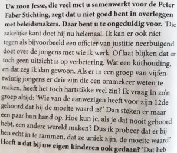

Peter Faber werkt veel met risicojongeren en (ex)gedetineerden. In een interview met Volkskrant Magazine zei hij daarover het volgende:

Dit citaat bleef in m'n hoofd zitten! Hij heeft namelijk helemaal gelijk: Neerbuigend doen tegen lastige jongeren? _Wat een kuthouding!_ Die negatieve blik kennen ze maar al te goed; Geef die jongens (en meisjes) in plaats daarvan eens het gevoel dat ze er wèl mogen zijn. Niet dat een positieve houding nou direct de oplossing is voor alle problemen, maar als je het nalaat sla je de plank sowieso mis.

Meer info: [http://www.peterfaberstichting.nl](http://www.peterfaberstichting.nl)

(PS. Over de verdere inhoud van het interview ben ik wisselend enthousiast; zo blijkt de beste man behoorlijk explosief te kunnen zijn in ruzies en geeft hij aan dat hij bovenstaand advies lang niet altijd heeft toegepast op z'n eigen kinderen. Maar goed, dat maakt bovenstaand citaat niet minder waar!)
