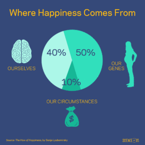

Sommige mensen lijken altijd gelukkig te zijn, terwijl anderen regelmatig in mineur zijn. Hoeveel invloed heb je eigenlijk op je eigen geluksniveau? Best wat, naar het schijnt!

Sonja Lyubomirsky deed er onderzoek naar en publiceerde hierover in 2008 het boek "The How of Happiness". Dit is wat ze ontdekte:

Voor enige nuance is het goed om in ieder geval even [dit artikel](https://www.thecut.com/2014/06/how-much-of-your-own-happiness-can-you-control.html) te lezen. Hoewel gebaseerd op allerlei onderzoeken, is dit nog geen vaststaande feiten. Haar argumenten klinken echter sterk. Daarnaast is het wat mij betreft sowieso prettig om te bedenken dat ik behoorlijk wat invloed heb op mijn eigen geluk.

Bron: [The Cut - Here’s How Much of Your Own Happiness Is Under Your Control](https://www.thecut.com/2014/06/how-much-of-your-own-happiness-can-you-control.html)
