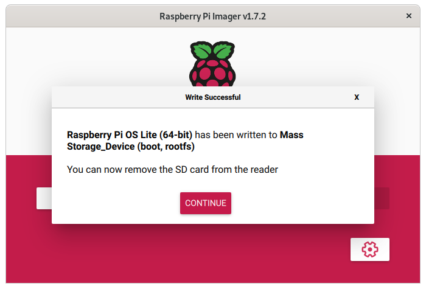
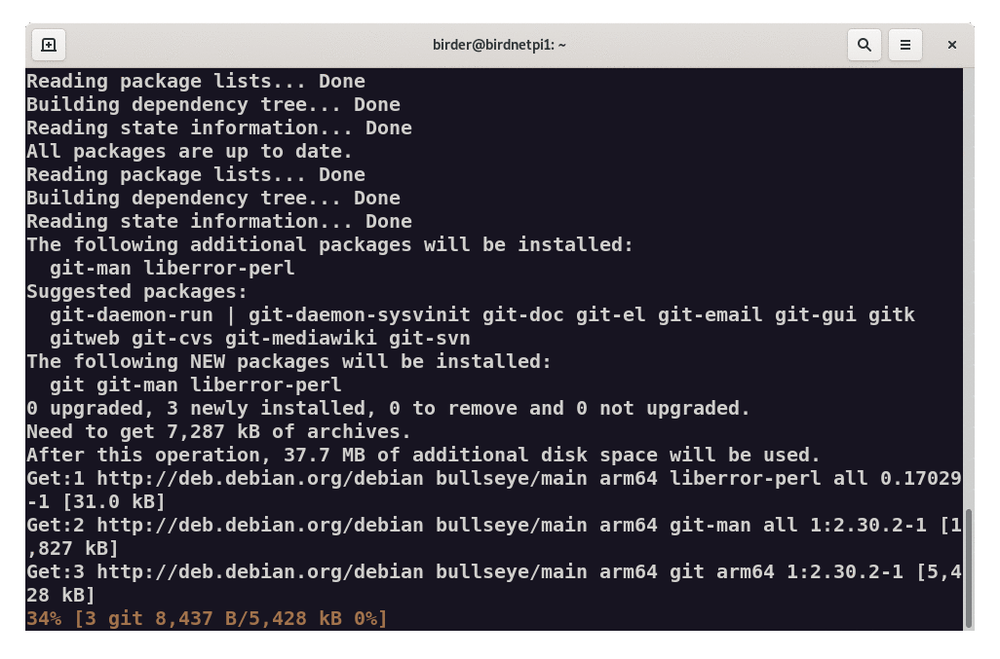
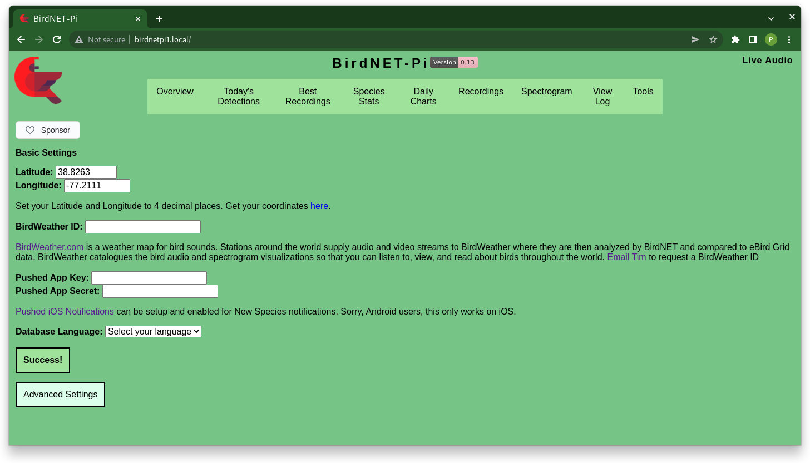
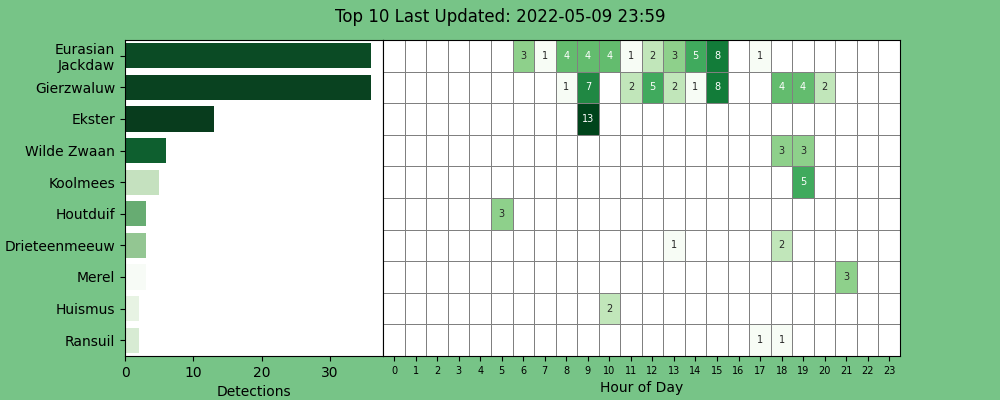

Sinds kort heb ik een tuin! Het is lente en ik hoor allerlei vogels! Maar welke? Ik ben nou niet bepaald een vogelaar. Zou daar geen technische oplossing voor zijn?  

## BirdNET-Pi: automatisch vogelgeluiden herkennen
Laatst ontdekte ik [BirdNetPi](https://birdnetpi.com), een programma dat realtime geluiden analyseert op vogelgeluiden en die vervolgens via machine-learning kan herkennen! Het programma installeer je op een [raspberry Pi](/tags/raspberry-pi/), je sluit een microfoon aan en plaatst het geheel in de tuin. Vervolgens is het wachten geblazen op de resultaten! 

Op een aantal plekken in de wereld zijn de verzamelde gegevens openbaar. Er staat er bijvoorbeeld één in Nijmegen! Benieuwd hoe het programma er uit ziet en/of welke vogels er rond die microfoon fluiten? Check dan [https://nijmegen.birdnetpi.com](https://nijmegen.birdnetpi.com)

## Zelf testen of dit werkt
### Benodigdheden verzamelen
De meeste materialen had ik al, de microfoon heb ik speciaal voor dit project besteld.  
- **Een Raspberri Pi**  
  (model 3b+ of 4, incl benodigdheden zoals SD-kaart, adapter, evt een behuizing). 
- **Een microfoon**  
  (liefst met een lange kabel (Ik heb er een besteld met een [zes meter lange kabel](https://nl.aliexpress.com/item/1005003770431532.html))
- **USB-geluidskaart met line-in**  
  (optioneel. Sommige microfoons werken zonder, ik had 'm wel nodig). 

### het installatieproces
Als je alle spullen hebt (plus wat ervaring met dit soort projecten) is het niet al te moeilijk de boel draaiend te krijgen; de [installation guide](https://github.com/mcguirepr89/BirdNET-Pi/wiki/Installation-Guide) is grondig en helder uitgeschreven. De software werd snel geinstalleerd en binnen no-time zat ik in de (vrij lelijk ontworpen) groene webomgeving. Enige probleem: de microfoon werkte niet! Na een tijdje bleek ik een USB geluidskaart nodig te hebben met line-in. Gelukkig had ik [deze USB geluidskaart](https://nl.aliexpress.com/item/1005003240530919.html) nog liggen voor een [ander project](https://github.com/iroQuai/RFID-kinderjukebox). Al met al was alles in een uurtje 'up and running'!  

  

### De hardware plaatsen
In eerste instantie had ik ideeën over een waterdichte enclosure om de raspberry pi buiten te laten staan. Evt met een batterij en zonnecel om zo niet afhankelijk te zijn van het stroomnet. Ik weet echter dat dat véél meer geld, werk en gedoe kost dan ik in deze testfase logisch vindt, dus ik het mezelf makkelijk gemaakt: De raspberry pi veilig binnen, de microfoon met de lange draad uit het raam gehangen, de tuin in!  (Het bestaat overigens wel, zo'n [zelf-sufficient versie op zonne-energie](https://github.com/mcguirepr89/BirdNET-Pi/discussions/69#discussioncomment-2125002)!)

 

### Testresultaten uit mijn eigen tuin
Op het moment dat alles 'up and running' was, was het al na 23:00u en was er geen vogel meer te bekennen. Een eerste test met een audio-clip van een duif werkte echter perfect èn snel! Dat stemde hoopvol. De volgende ochtend bleken er al behoorlijk wat vogels geregisteerd te zijn. Na een dag werken was de overzichtskaart prachtig gevuld!  

De kwaliteit van de microfoon bleek acceptabel, maar niet fantastisch. Zeker de vogels die regelmatig voorkomen in de lijst, zijn vaak wel goed geregistreerd. Deze vogels heb ik bijvoorbeeld zelf ook in de tuin gezien: 
- Kauw (Dat is de Nederlandse benaming voor de Eurasian Jackdaw)
- Gierzwaluw
- Ekster
- Houtduif _(of ten minste, het was een duif. Ik verder heb ik ook geen idee)_
- Koolmees
- Gaai _(Nutteloos weetje: Gaaien heten geen Vlaamse Gaai meer, omdat alle andere gaaiensoorten zijn uitgestorven)_

Een aantal keer ging het echter finaal mis. 
- Die Wilde Zwaan was de kip van de buren
- De schreeuw van mijn dochtertje (1,5jr) werd meermaals geregistreerd als een drieteenmeeuw
- Er bleek ook geen ransuil in de tuin te zitten; dat bleken de buurkinderen op de trampoline te zijn!

### Conclusie
Op basis van het aantal registraties (en de bijbehorende geluidsfragmenten) kun je best makkelijk bepalen of een vogel daadwerkelijk aanwezig is geweest. Zo lang je de data niet zomaar voor lief neemt, al met al toch best een indrukwekkende score! Dat maakt BirdNET-Pi een fascinerend  project. Maar niet zonder haken en ogen. Je moet technisch redelijk onderlegd zijn om de boel draaiend te krijgen (en houden). Je zal voor lief moeten nemen dat dit allerminst software is voor eindgebruikers. Daarnaast is het ook op het gebied van privacy discutabel om constant een microfoon in je tuin te hebben hangen, zeker als je in een drukbevolkt gebied woont en dus ook je buren 24/7 aan het opnemen bent. De recent ontwikkelde [privacy-mode](https://github.com/mcguirepr89/BirdNET-Pi/discussions/166) doet daar mijns inziens weinig afbreuk aan. Al met al was het leuk om eens te testen, maar voor mij geen optie om standaard in de tuin te hebben hangen. Jammer wel, want het idee vind ik wel erg tof. 

## versies voor op je telefoon!
Het blijkt dat je BirdNET ook op je smartphone kan installeren! Dan draait de software niet de hele tijd, maar kun je handmatig een opname starten om een specifiek vogelgeluid te laten analyseren. De software is een stuk beter doorontwikkeld ten opzichte van BirdNET-Pi en ook qua privacy is het wat mij betreft veel beter om zelf te kunnen kiezen wat wel opgenomen wordt, en wat niet. 

Zelf testen? check [https://birdnet.cornell.edu](https://birdnet.cornell.edu) via je smartphone (android of iOS)